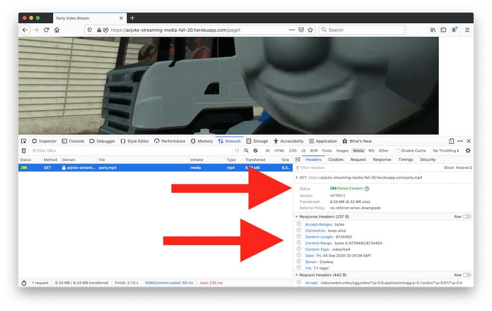

# Week-3 (9/08/20 & 9/10/20)

## I. Steaming Media Assignment

### I-A. More on HTTP Protocol

- Let's discuss how a browser downloads and assembles a web page - head to this demo in Chrome or Firefox, and open the Web Inspector:
 - http://igm.rit.edu/~acjvks/courses/shared/430/simple-server-request-demo/middle-aged-man.html
 
 
### I-B. In-class Demo
- Let's add an image to the landing page of our HW - Node Simple Web API:
  - Instructions: https://github.com/tonethar/IGME-430-Shared/blob/master/notes/HW-node-simple-web-api.md
  - Current state of landing page (no image): https://dorkus-jokes.herokuapp.com/
  - Here's the image we want to use - it is hosted at igm.rit.edu: http://igm.rit.edu/~acjvks/courses/shared/430/simple-server-request-demo/images/mam.jpg
  - GOAL: Get this image to appear on the bottom of the landing page
- Now let's have our NodeJS server host the image
  - GOAL: Host the image locally and serve it up so that it appears on the page, DO NOT use the igm.rit.edu link above

### I-c. Stream Media HW
- The assignment is in Week 2 content section of myCourses
- The "done" example is here:
  - https://acjvks-streaming-media-fall-20.herokuapp.com
  - https://acjvks-streaming-media-fall-20.herokuapp.com/page2
  - https://acjvks-streaming-media-fall-20.herokuapp.com/page3
- Here's a screenshot of the headers:

  
 

| <-- Previous Unit | Home | Next Unit -->
| --- | --- | --- 
| [**week-2.md**](week-2.md)     |  [**IGME-430 Home**](../README.md) | **week-4.md**
